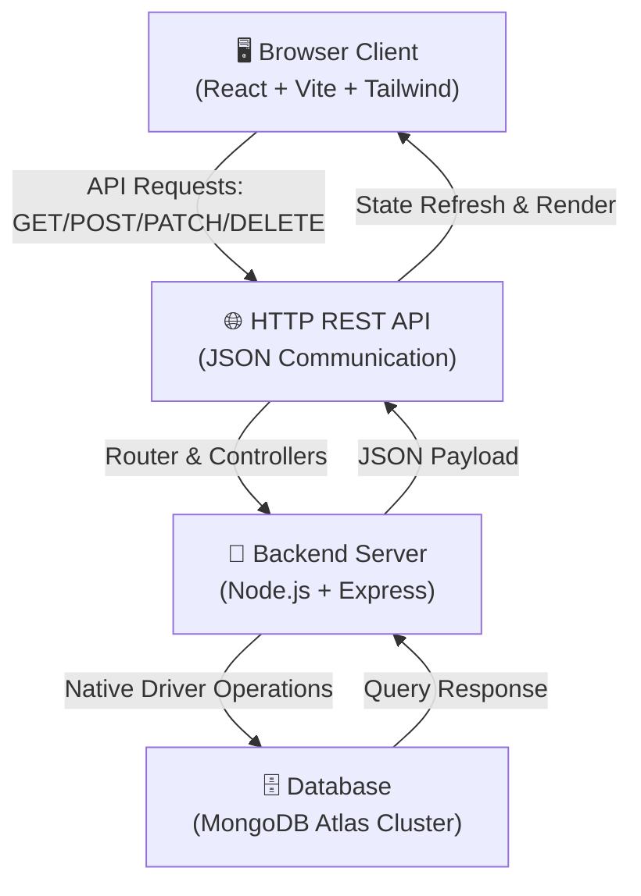

# 🚀 MERN Stack Employee Management System (Day 2)

A beautifully structured, professional, and modern full-stack web application designed for streamlined employee record management. This project was developed as part of **Day 2 of the MERN Stack Class** and features a clean **React 19** frontend styled with **Tailwind CSS**, and a **Node.js/Express.js** backend powered by the **MongoDB Driver**.

---

## 📖 Project Overview

This **Employee Management System** is a real-time full-stack application that allows HR administrators and managers to perform standard **CRUD (Create, Read, Update, Delete)** operations on employee records. 

### ✨ Key Features
- **Centralized Database**: Stores employee records securely in a MongoDB Atlas cluster.
- **Real-Time Synchronized UI**: Experience instant visual updates on list modifications without page reloads.
- **Responsive Modern Interface**: A premium user interface crafted using React 19, Tailwind CSS, and elegant micro-interactions.
- **Robust REST API**: A clean, scalable backend built on Express.js utilizing standard HTTP methods.

---

## 🧠 System Architecture



---

## 🧰 Tech Stack

### Frontend (`/client`)
- **React (v19.2.5)**: Modern, component-driven UI utilizing standard React Hooks (`useState`, `useEffect`).
- **Vite**: Ultra-fast frontend build tool and local development server.
- **React Router DOM (v6.20.0)**: Smooth client-side routing for seamless page navigation.
- **Tailwind CSS**: Utility-first styling framework for fluid, responsive, and elegant UI components.

### Backend (`/server`)
- **Node.js**: Asynchronous, event-driven JavaScript runtime environment.
- **Express.js (v5.2.1)**: Lightweight web application framework managing HTTP middleware and routing.
- **MongoDB Native Driver**: Official driver utilized to perform direct, fast, and optimized operations against MongoDB Atlas.
- **dotenv**: Secure management of environment configurations.

---

## 📂 Directory Structure

```text
MERN/
├── client/                     # React Frontend App
│   ├── src/
│   │   ├── components/         # Reusable UI Elements
│   │   │   ├── Navbar.jsx      # Header Navigation
│   │   │   ├── Record.jsx      # Form component to Add/Edit Employees
│   │   │   └── RecordList.jsx  # Main Employee Directory Table
│   │   ├── App.jsx             # Main Application Routing Wrapper
│   │   ├── main.jsx            # React App Entry Point
│   │   └── index.css           # Global Styles & Tailwind Directives
│   ├── public/                 # Static Assets
│   ├── tailwind.config.js      # Tailwind Configuration
│   └── package.json            # Frontend Dependencies & Scripts
│
└── server/                     # Express.js Backend App
    ├── db/
    │   └── connection.js       # MongoDB Atlas connection setup
    ├── routes/
    │   └── record.js           # REST API Route Handlers for CRUD operations
    ├── server.js               # Express Server Entry Point
    ├── config.env              # Local Environment Secrets (⚠️ git-ignored!)
    └── package.json            # Backend Dependencies & Scripts
```

---

## ⚙️ Quick Start & Setup

Follow these simple steps to install dependencies and run both the server and client applications locally.

### 📋 Prerequisites
- **Node.js** (v18.0.0 or higher recommended)
- **npm** (v9.0.0 or higher)

---

### 1️⃣ Backend Setup (`/server`)

1. Open your terminal and navigate to the server folder:
   ```bash
   cd server
   ```

2. Install backend dependencies:
   ```bash
   npm install
   ```

3. Configure your local environment variables. Create a `config.env` file in the `server` directory and paste your MongoDB Atlas URI:
   ```env
   # server/config.env
   ATLAS_URI=your_mongodb_atlas_connection_string
   PORT=5050
   ```
   > [!NOTE]
   > A local `config.env` has already been configured with a working MongoDB Atlas Cluster connection for this workspace.

4. Launch the backend development server:
   ```bash
   npm start
   ```
   *Expected Output:*
   ```text
   Server listening on port 5050
   Pinged your deployment. You successfully connected to MongoDB!
   ```

---

### 2️⃣ Frontend Setup (`/client`)

1. Open a new terminal window or tab and navigate to the client folder:
   ```bash
   cd client
   ```

2. Install frontend dependencies:
   ```bash
   npm install
   ```

3. Start the Vite development server:
   ```bash
   npm run dev
   ```
   *Expected Output:*
   ```text
     VITE v8.0.10  ready in 150 ms

     ➜  Local:   http://localhost:5173/
     ➜  Network: use --host to expose
   ```

4. Open your browser and navigate to **[http://localhost:5173](http://localhost:5173)** to explore the application!

---

## 📡 REST API Specifications

The Express.js server provides the following endpoints to handle employee records on port `5050`:

| Method | Endpoint | Description | Request Body | Response |
| :--- | :--- | :--- | :--- | :--- |
| **GET** | `/record` | Retrieve all employee records | None | `200 OK` (Array of records) |
| **GET** | `/record/:id` | Retrieve a single employee by ID | None | `200 OK` (Employee object) or `404` |
| **POST** | `/record` | Create a new employee record | `{ name, position, level }` | `204 No Content` or `500` |
| **PATCH** | `/record/:id` | Update an existing employee record | `{ name, position, level }` (Partial) | `200 OK` or `500` |
| **DELETE** | `/record/:id` | Delete an employee record | None | `200 OK` or `500` |

---

## 🔒 Best Practices Implemented

- **Secure Environment Variables**: Sensitive data (like MongoDB Atlas connection strings) is kept inside `config.env`, which is strictly excluded from version control using `.gitignore`.
- **Cross-Origin Resource Sharing (CORS)**: Safely enables the React frontend (`localhost:5173`) to communicate with the Express backend (`localhost:5050`).
- **Clean Separation of Concerns**: Highly decoupled client and server architectures allow independent updates and testing.